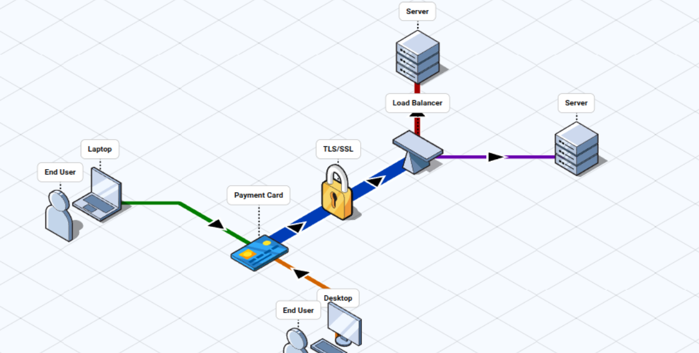

# Generacion de Diagramas Isometricos para proyectos 

- este es un proyecto codigo abierto que apoya a la creacion de diagramas de flujo generales y en 3D 

## Repo del proyecto
 - el lik del proyecto es este https://github.com/stan-smith/FossFLOW?tab=readme-ov-file
 se podra ver todo lo necesario 
 ---
 PROS:
 - Puedes generar un entorno local para poder estar manejandolo tu
 - Puedes hacerlo de modo virtual por la pagina 
 - Muchos iconos y facil uso 
 --- 
 CONTRAS:
 - Dificil de entender al comienzo 
 - Tiene bugs (esperemos en un futuro se solucionen)

 --- 
 ## Como se ve ??

